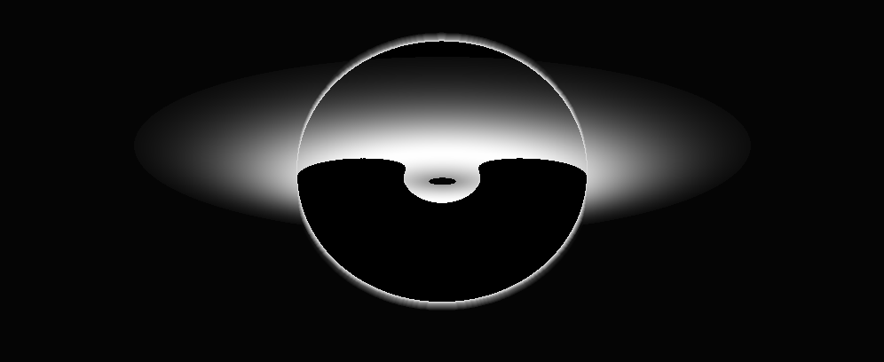

# Interstellar Donut 🍩

A mesmerizing rotating ASCII donut (torus) in the terminal with gravitational lensing effects inspired by general relativity and the movie "Interstellar".



```
..............................................................................,,,,,,,,,,..............................................................................
............................................................................,-~~~~~~~~~~-,............................................................................
.....................................................................,-------:;;;;;;;;;;:-------,.....................................................................
..................................................................,---:;;;;;;;          ;;;;;;;:---,..................................................................
...............................................................,--:;;;;                        ;;;;:--,...............................................................
..............................................................-:;;;                                ;;;:-..............................................................
............................................................-:;;                                      ;;:-............................................................
...........................................................:;;                                          ;;:...........................................................
..........................................................:;                                              ;:..........................................................
.........................................................:;                                                ;:.........................................................
........................................................:;                                                  ;:........................................................
.......................................................:;                                                    ;:.......................................................
......................................................-;                                                      ;-......................................................
......................................................-;          ~~~~:::::;;;;;;;;;;;;;;;;;;:::::~~~         ;-......................................................
.....................................................,:;   ~~:::;;;===!!!!*******************!!!!!===;;:::~~  ;:,,....................................................
...................................................,,-; ~~:;;==         ***********************       !!==;;::~;--,,..................................................
..................................................,,--;~                    ;;;::::::::;;;                    :;~--,,.................................................
...................................................,,-;                     :;;;:----:;;;~                    ;:--,,..................................................
......................................................:;                        ;;;;;;                        ;-,.....................................................
......................................................-;                                                      ;-......................................................
.......................................................:;                                                    ;:.......................................................
.......................................................-;                                                   ;:........................................................
........................................................:;;                                                ;:.........................................................
.........................................................-:;                                              ;:..........................................................
...........................................................:;                                           ;;:...........................................................
............................................................:;;                                       ;;:-............................................................
.............................................................-:;;;                                  ;;:-..............................................................
..............................................................,--:;;;                           ;;;;:-,...............................................................
.................................................................,--:;;;;;;                ;;;;;:---,.................................................................
....................................................................,-----:;;;;;;;;;;;;;;;;:----,.....................................................................
.........................................................................,------------------,.........................................................................
......................................................................................................................................................................
......................................................................................................................................................................
......................................................................................................................................................................
```

## Features

- **Rotating 3D Torus**: A spinning donut rendered in beautiful ASCII art
- **Gravitational Lensing**: Light bending effects simulating a black hole's gravity according to general relativity
- **Accretion Disk Glow**: A photon sphere glow effect around the center
- **Gravitational Redshift**: Luminosity dimming near the event horizon
- **Real-time Animation**: Smooth rotation with proper depth buffering and perspective projection

## Physics Background

This visualization combines:

1. **Classic Donut Rendering**: Based on the famous "donut.c" by Andy Sloane, rendering a 3D torus using ASCII characters with proper lighting and rotation.

2. **General Relativity Effects**:
   - **Light Deflection**: Light paths bend near massive objects following the Schwarzschild metric
   - **Gravitational Redshift**: Light loses energy (appears dimmer) as it escapes from near the black hole
   - **Photon Sphere**: A glowing region where photons can orbit the black hole

## Requirements

- Python 3.6 or higher
- A terminal that supports ANSI escape codes (most modern terminals)

## How It Works

The script:

1. **Creates a 3D Torus**: Generates points on the surface of a mathematical torus
2. **Applies Rotation**: Rotates the torus in 3D space using rotation matrices
3. **Simulates Light Bending**: Calculates gravitational deflection of light rays near the black hole center
4. **Projects to 2D**: Uses perspective projection to convert 3D coordinates to screen space
5. **Computes Visibility**: Determines which parts of the torus and accretion disk are visible in front of the black hole shadow
6. **Renders ASCII**: Draws the accretion disk, torus silhouette, and glow/ring overlays using a fixed set of ASCII characters
7. **Adds Effects**: Overlays a photon sphere–like glow and ring structure around the black hole

## The Science

The gravitational lensing is based on simplified general relativity:

- **Schwarzschild Radius**: The event horizon radius where escape velocity equals the speed of light
- **Deflection Angle**: Light bending is proportional to `2GM/(rc²)` where G is gravitational constant, M is mass, r is distance, and c is speed of light
- **Redshift Factor**: `1 - r_s/r` where r_s is Schwarzschild radius and r is distance from the black hole

## Inspiration

Inspired by:
- The original "donut.c" by Andy Sloane (2006)
- The movie "Interstellar" (2014) and its scientifically accurate black hole visualization
- The work of physicist Kip Thorne on black hole visualization
